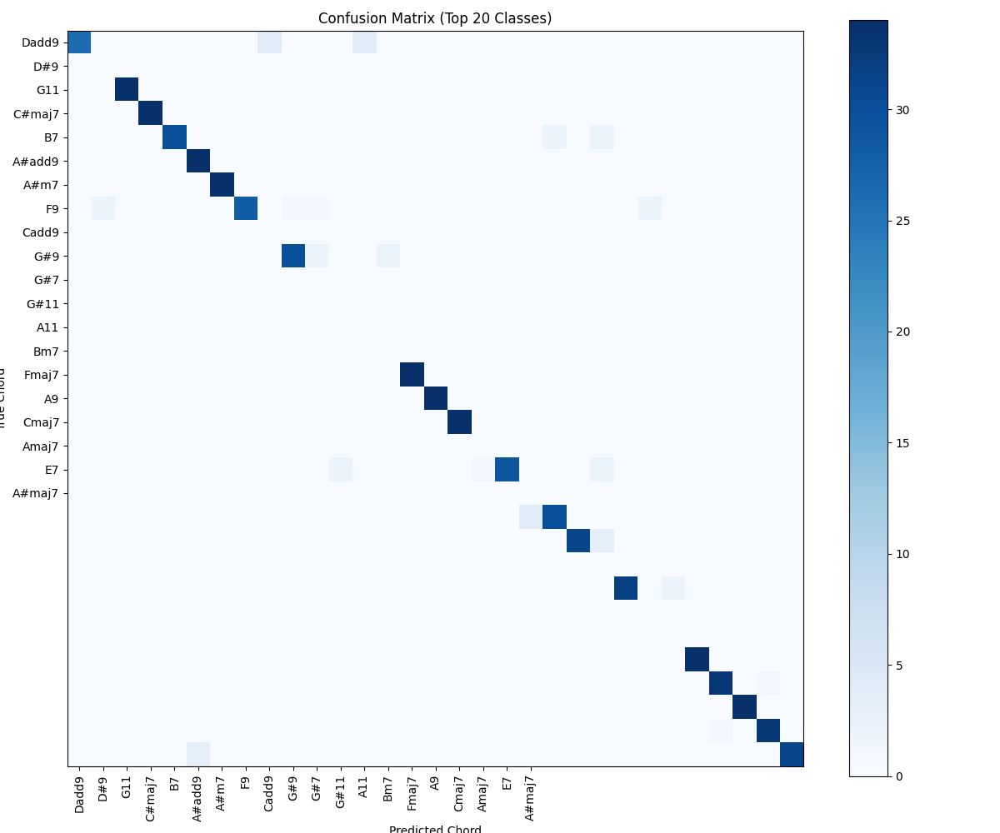

# ChordDetect AI

An AI-powered system for detecting and classifying chord progressions in music.



## Overview

ChordDetect AI is a machine learning system that can:

- Recognize over 120 different chord types across all 12 musical keys
- Process audio recordings and identify chord progressions
- Extract harmonic content from mixed audio sources
- Generate MIDI files from detected chord progressions
- Handle different chord inversions and voicings

This project provides a complete end-to-end pipeline from audio input to chord sequence output.

## Features

- **Advanced Audio Processing**: Uses source separation to isolate harmonic content
- **Intelligent Beat Detection**: Multiple strategies for beat and segment detection
- **Comprehensive Chord Recognition**: Supports major, minor, seventh, ninth, eleventh chords and more
- **High Accuracy**: Trained on thousands of synthetically generated chord samples
- **MIDI Output**: Convert detected chords to MIDI for use in DAWs

## Installation

1. Clone this repository
2. Install the required dependencies:

```bash
pip install -r requirements.txt
```

For optimal performance, install with GPU support:

```bash
pip install tensorflow-gpu
```

## Usage

### 1. Generate Training Data (Optional)

If you want to regenerate the training data:

```bash
python generate.py
```

This will create thousands of chord samples in the `chord_segments` directory and catalog them in `chords.db`.

### 2. Train the Model (Optional)

If you want to retrain the model or train on your own data:

```bash
python train.py
```

This will train a CNN model and save it as `chord_classifier_model.h5`.

### 3. Analyze a Song

To detect chords in an audio file:

```bash
python infer.py path/to/your/audio_file.mp3
```

Results will be saved to `results.json`.

Options:
- `--no-demucs`: Disable source separation
- `--output=filename.json`: Specify custom output path

### 4. Generate MIDI

To convert detection results to a MIDI file:

```bash
python midi.py results.json
```

This will create a MIDI file with the detected chord progression.

## Project Structure

See [ARCHITECTURE.md](docs/ARCHITECTURE.md) for detailed information about the system architecture and components.

## Examples

The repository includes a sample file (`daylight.mp3`) that you can use to test the system:

```bash
python infer.py daylight.mp3
python midi.py results.json
```

## Model Performance

The model achieves 92% accuracy on the test dataset across 120 chord types. See the confusion matrix and training history visualizations for more details.

## License

MIT License

## Acknowledgements

- [librosa](https://librosa.org/) for audio processing
- [TensorFlow](https://www.tensorflow.org/) for model training
- [Demucs](https://github.com/facebookresearch/demucs) for source separation
- [mido](https://mido.readthedocs.io/) for MIDI file handling