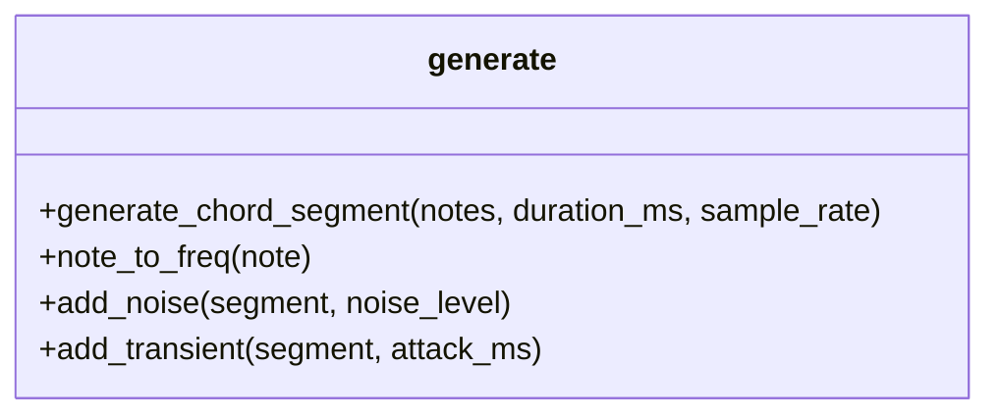
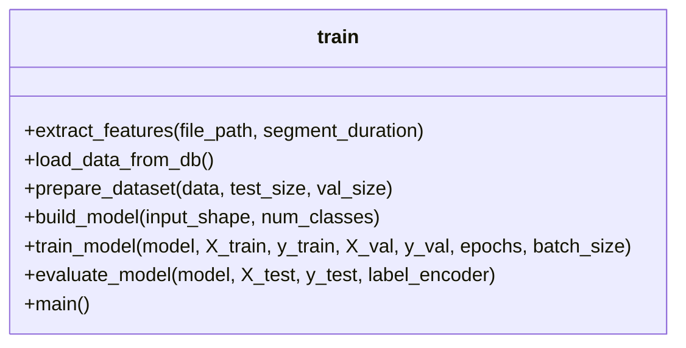
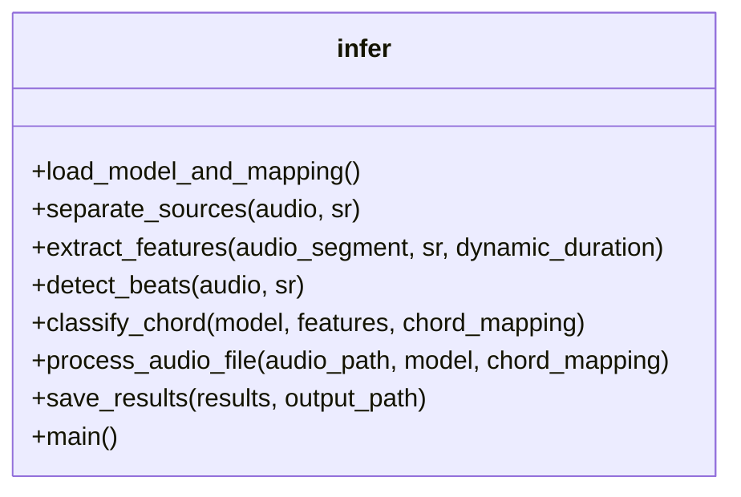
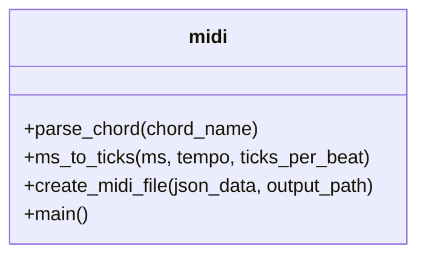

# ChordDetect AI API Reference

This document provides a reference for the main functions and classes in the ChordDetect AI project.

## Module: generate.py

Functions for generating synthetic chord audio samples.



### Key Functions

#### `generate_chord_segment(notes, duration_ms, sample_rate)`

Generates an audio segment for a single chord.

**Parameters:**
- `notes`: List of MIDI note numbers
- `duration_ms`: Duration in milliseconds
- `sample_rate`: Audio sample rate

**Returns:**
- `AudioSegment`: A Pydub AudioSegment object

#### `note_to_freq(note)`

Converts a MIDI note number to frequency.

**Parameters:**
- `note`: MIDI note number

**Returns:**
- Frequency in Hz

#### `add_noise(segment, noise_level=0.01)`

Adds random noise to an audio segment.

**Parameters:**
- `segment`: Pydub AudioSegment
- `noise_level`: Amount of noise to add (0.0-1.0)

**Returns:**
- Modified AudioSegment

#### `add_transient(segment, attack_ms=10)`

Adds attack transients to an audio segment.

**Parameters:**
- `segment`: Pydub AudioSegment
- `attack_ms`: Attack duration in milliseconds

**Returns:**
- Modified AudioSegment

## Module: train.py

Functions for training the chord classification model.



### Key Functions

#### `extract_features(file_path, segment_duration=3.0)`

Extracts MFCC features from an audio file.

**Parameters:**
- `file_path`: Path to audio file
- `segment_duration`: Duration in seconds to analyze

**Returns:**
- Numpy array of MFCC features

#### `build_model(input_shape, num_classes)`

Builds a CNN model for chord classification.

**Parameters:**
- `input_shape`: Shape of input features
- `num_classes`: Number of chord classes

**Returns:**
- Compiled Tensorflow Keras model

#### `train_model(model, X_train, y_train, X_val, y_val, epochs=30, batch_size=32)`

Trains the model.

**Parameters:**
- `model`: Compiled Keras model
- `X_train`, `y_train`: Training data
- `X_val`, `y_val`: Validation data
- `epochs`: Number of epochs
- `batch_size`: Batch size

**Returns:**
- Training history

#### `evaluate_model(model, X_test, y_test, label_encoder)`

Evaluates the model on test data.

**Parameters:**
- `model`: Trained Keras model
- `X_test`, `y_test`: Test data
- `label_encoder`: LabelEncoder object

## Module: infer.py

Functions for inferring chords from audio files.



### Key Functions

#### `load_model_and_mapping()`

Loads the trained model and chord mapping.

**Returns:**
- `model`: Trained TensorFlow model
- `chord_mapping`: DataFrame with chord mapping

#### `separate_sources(audio, sr=44100)`

Separates audio into harmonic sources.

**Parameters:**
- `audio`: Audio signal as numpy array
- `sr`: Sample rate

**Returns:**
- `combined_harmonic_audio`: Harmonic content (instruments + bass)
- `instruments_only_audio`: Just instruments without bass

#### `detect_beats(audio, sr)`

Detects beats in an audio file using multiple strategies.

**Parameters:**
- `audio`: Audio signal as numpy array
- `sr`: Sample rate

**Returns:**
- `beats`: Beat positions in samples
- `beat_times`: Beat positions in seconds
- `tempo`: Estimated tempo in BPM

#### `extract_features(audio_segment, sr=44100, dynamic_duration=None)`

Extracts MFCC features from an audio segment.

**Parameters:**
- `audio_segment`: Audio segment as numpy array
- `sr`: Sample rate
- `dynamic_duration`: Optional duration based on beat length

**Returns:**
- MFCC features

#### `classify_chord(model, features, chord_mapping)`

Classifies a chord using the trained model.

**Parameters:**
- `model`: Trained TensorFlow model
- `features`: MFCC features
- `chord_mapping`: DataFrame with chord mapping

**Returns:**
- Predicted chord name

#### `process_audio_file(audio_path, model, chord_mapping)`

Processes an audio file to detect chord progression.

**Parameters:**
- `audio_path`: Path to the audio file
- `model`: Trained TensorFlow model
- `chord_mapping`: DataFrame with chord mapping

**Returns:**
- Dictionary with BPM and chord information

## Module: midi.py

Functions for converting chord progressions to MIDI.



### Key Functions

#### `parse_chord(chord_name)`

Parses a chord name and returns the MIDI notes for that chord.

**Parameters:**
- `chord_name`: String like "C", "Cm", "G7", etc.

**Returns:**
- List of MIDI note numbers for that chord

#### `ms_to_ticks(ms, tempo, ticks_per_beat)`

Converts milliseconds to MIDI ticks.

**Parameters:**
- `ms`: Time in milliseconds
- `tempo`: Tempo in BPM
- `ticks_per_beat`: MIDI ticks per beat

**Returns:**
- Time in MIDI ticks

#### `create_midi_file(json_data, output_path)`

Creates a MIDI file from chord detection JSON.

**Parameters:**
- `json_data`: Parsed JSON data with chord information
- `output_path`: Path to save the MIDI file

## Constants and Definitions

### Chord Intervals

```python
CHORD_INTERVALS = {
    # Major chords
    '': [0, 4, 7],           # Major (C = C, E, G)
    'maj': [0, 4, 7],        # Major (same as '')
    'M': [0, 4, 7],          # Major (alternate notation)
    
    # Minor chords
    'm': [0, 3, 7],          # Minor (Cm = C, Eb, G)
    'min': [0, 3, 7],        # Minor (alternate notation)
    '-': [0, 3, 7],          # Minor (alternate notation)
    
    # Seventh chords
    '7': [0, 4, 7, 10],      # Dominant 7th (C7 = C, E, G, Bb)
    'maj7': [0, 4, 7, 11],   # Major 7th (Cmaj7 = C, E, G, B)
    'M7': [0, 4, 7, 11],     # Major 7th (alternate)
    'm7': [0, 3, 7, 10],     # Minor 7th (Cm7 = C, Eb, G, Bb)
    
    # ... more chord types
}
```

### Root Notes

```python
ROOT_NOTES = {
    'C': 0, 'C#': 1, 'Db': 1, 'D': 2, 'D#': 3, 'Eb': 3,
    'E': 4, 'F': 5, 'F#': 6, 'Gb': 6, 'G': 7, 'G#': 8,
    'Ab': 8, 'A': 9, 'A#': 10, 'Bb': 10, 'B': 11
}
```

### Feature Extraction Parameters

```python
SAMPLE_RATE = 44100  # Hz
N_MFCC = 40         # Number of MFCC features
N_FFT = 2048        # FFT window size
HOP_LENGTH = 512    # Hop length for FFT
```

## Data Structures

### JSON Output Format

The inference pipeline outputs a JSON file with the following structure:

```json
{
  "bpm": 120.5,
  "chords": [
    {"start": 0, "chord": "C"},
    {"start": 2000, "chord": "G"},
    {"start": 4000, "chord": "Am"},
    {"start": 6000, "chord": "F"}
  ]
}
```

### Database Schema

The chord metadata is stored in a SQLite database with the following schema:

```sql
CREATE TABLE IF NOT EXISTS segments (
    id INTEGER PRIMARY KEY AUTOINCREMENT,
    file_name TEXT,
    chord_name TEXT
)
```

## Command Line Interface

### generate.py

Runs without arguments to generate all chord samples.

### train.py

Runs without arguments to train the model.

### infer.py

```
Usage: python infer.py <audio_file_path> [options]
Options:
  --no-demucs               Disable Demucs source separation
  --output=<file_path>      Specify output JSON file path
```

### midi.py

```
Usage: python midi.py results.json [output.mid]
```