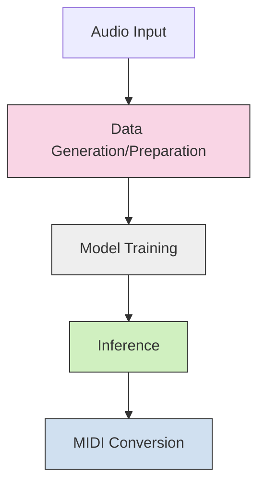
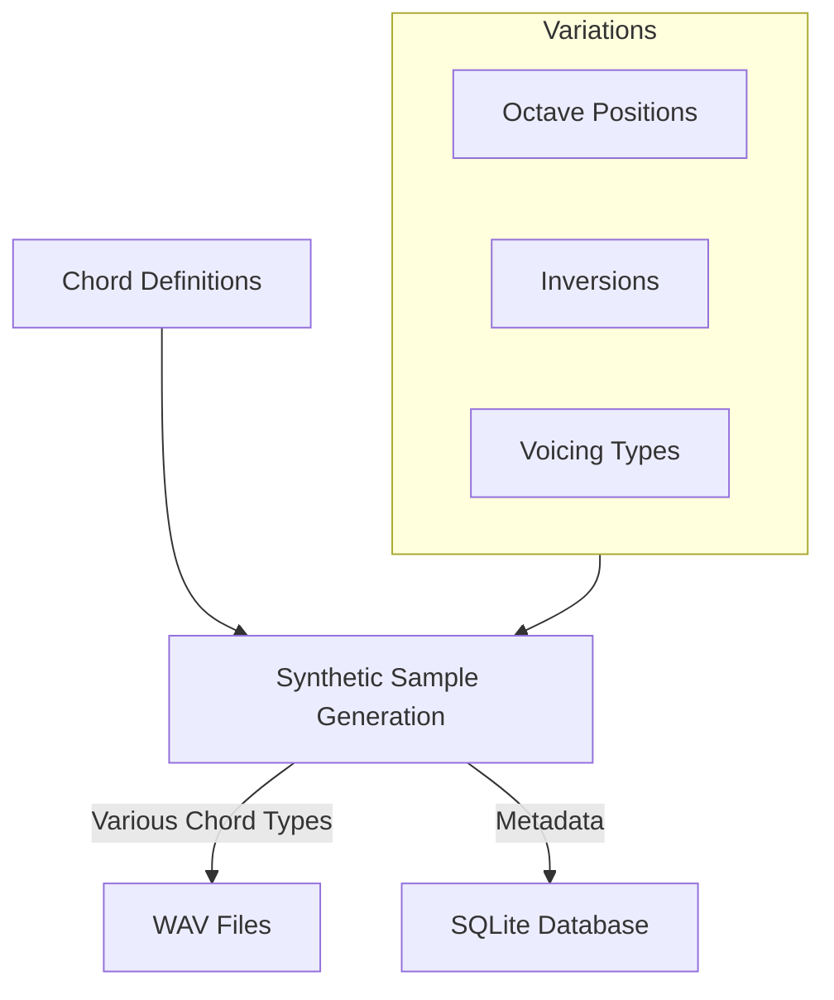
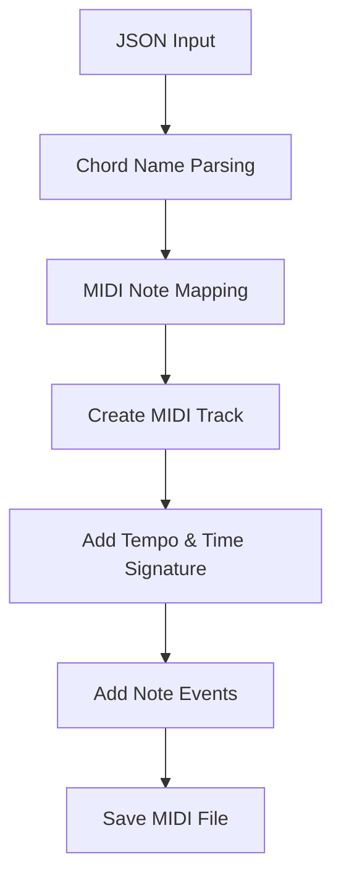
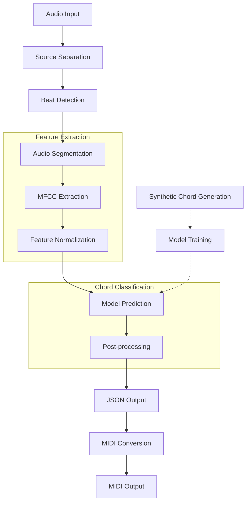
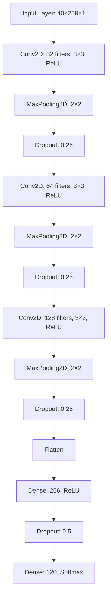
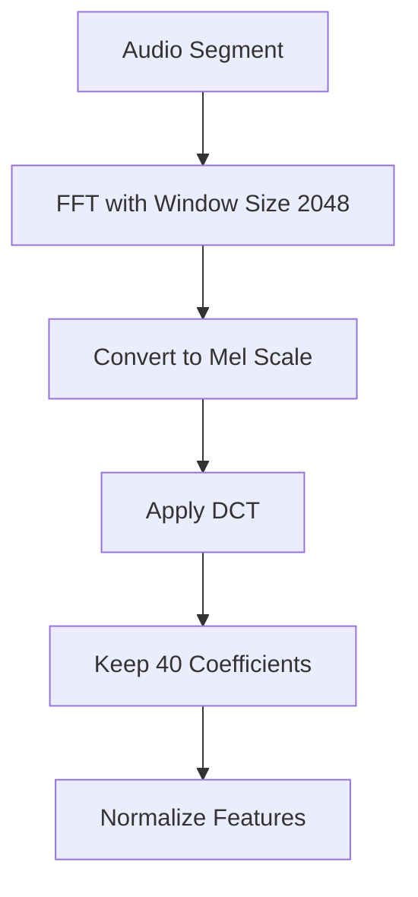
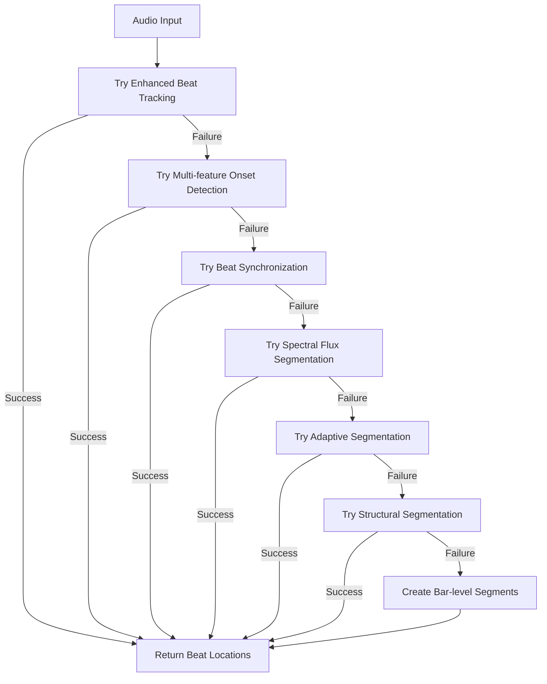
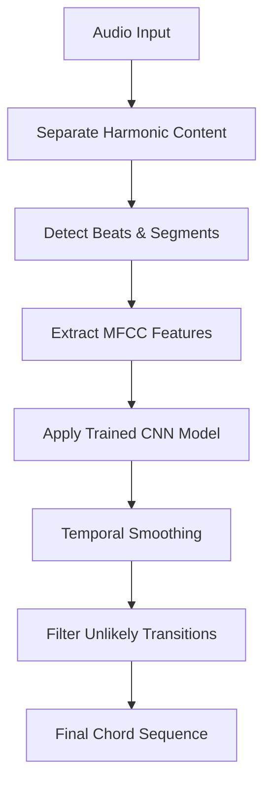

# ChordDetect AI: System Architecture

This document provides a detailed overview of the ChordDetect AI system architecture, including its components, data flow, and technical implementation.

## High-Level Architecture

The system follows a machine learning pipeline with three main phases:



## System Components

The system is composed of four main components, each implemented in its own Python file:

### 1. Data Generation (`generate.py`)

Responsible for creating synthetic chord audio samples:



Features:
- Creates samples for 120 chord types (12 roots × 10 chord types)
- Generates multiple variations for each chord:
  - 5 octave positions (very low to very high)
  - Different inversions (root, first, second)
  - 6 voicing types (drop2, spread, cluster, etc.)
- Uses different synthetic timbres
- Adds realistic variations (noise, transients)
- Stores metadata in `chords.db` SQLite database

### 2. Model Training (`train.py`)

Handles feature extraction and model training:

```mermaid
graph TD
    A[Audio Samples] --> B[MFCC Feature Extraction]
    B --> C[Data Split]
    C --> D[CNN Model Training]
    D --> E[Model Evaluation]
    D --> F[Save Trained Model]
    
    subgraph Training Process
        G[Early Stopping]
        H[Learning Rate Reduction]
        I[Validation Monitoring]
    end
    
    Training Process --> D
```

Features:
- Extracts MFCC (Mel-frequency cepstral coefficients) features
- Splits data into training, validation, and test sets
- Implements a CNN architecture for chord classification
- Includes early stopping and learning rate reduction
- Evaluates model performance with accuracy metrics
- Creates confusion matrix visualization
- Saves the trained model to `chord_classifier_model.h5`
- Creates chord mapping in `chord_mapping.csv`

### 3. Inference Pipeline (`infer.py`)

Processes new audio to detect chord progressions:

```mermaid
graph TD
    A[Audio Input] --> B[Source Separation]
    B --> C[Beat Detection]
    C --> D[Audio Segmentation]
    D --> E[MFCC Feature Extraction]
    E --> F[Model Prediction]
    F --> G[Post-processing]
    G --> H[JSON Output]
    
    subgraph Beat Detection Strategies
        I[Enhanced Beat Tracking]
        J[Multi-feature Onset Detection]
        K[Spectral Flux Analysis]
        L[Adaptive Segmentation]
        M[Structural Segmentation]
    end
    
    Beat Detection Strategies --> C
```

Features:
- Uses Demucs for harmonic source separation (if available)
- Implements multiple beat detection strategies with fallbacks
- Segments audio based on detected beats
- Extracts MFCC features matching the training process
- Applies the trained model to classify chord in each segment
- Post-processes results to smooth chord transitions
- Outputs a JSON file with chord progression and timing

### 4. MIDI Conversion (`midi.py`)

Converts JSON chord progression to MIDI:



Features:
- Parses chord names to identify root and type
- Maps chord types to MIDI note combinations
- Creates properly timed MIDI events
- Handles advanced chord types (9th, 11th, suspended, etc.)
- Maintains timing from the original detection
- Outputs a playable MIDI file

## Data Flow

The complete data flow through the system:



## Technical Details

### Model Architecture

The CNN model architecture used for chord classification:



### Feature Extraction

MFCC (Mel-frequency cepstral coefficients) extraction process:



### Beat Detection

Multi-strategy approach with fallbacks:



## Chord Recognition Process

The recognition process combines multiple techniques for optimal results:



## File Structure

```
chord-detect-AI/
├── chord_classifier_model.h5    # Trained CNN model
├── chord_mapping.csv           # Mapping from model output to chord names
├── chord_segments/             # Directory of generated chord samples
├── chords.db                   # SQLite database of chord metadata
├── confusion_matrix.png        # Model evaluation visualization
├── generate.py                 # Script for synthetic sample generation
├── infer.py                    # Chord inference script
├── midi.py                     # MIDI conversion script
├── requirements.txt            # Python dependencies
├── results.json                # Inference results
├── train.py                    # Model training script
└── training_history.png        # Training metrics visualization
```