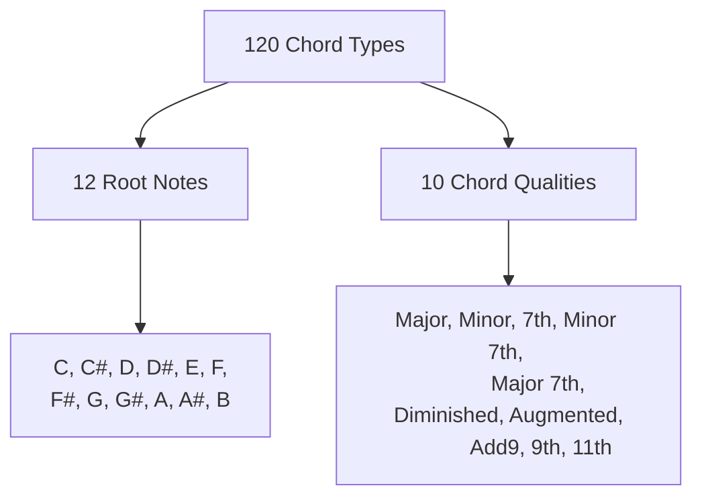
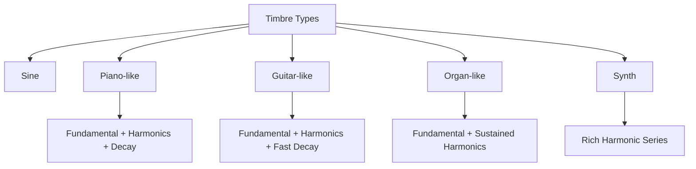
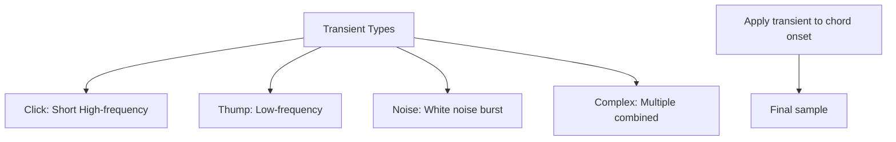

# Data Generation Process

This document provides detailed information about the synthetic chord data generation process used in the ChordDetect AI project.

## Overview

The training data for the chord classification model consists of synthetically generated audio samples representing different chord types, variations, and voicings. This approach allows for a large, balanced dataset with perfect ground truth labels.

## Chord Types

The system generates samples for 120 different chord types:



## Synthetic Sample Creation

Each chord is generated with multiple variations:

```mermaid
flowchart TD
    A[Chord Definition] --> B[Generate MIDI Notes]
    B --> C[Create Audio Samples]
    
    subgraph "Variations"
        D[Different Octaves]
        E[Chord Inversions]
        F[Voicing Types]
    end
    
    Variations --> B
    
    subgraph "Audio Processing"
        G[Apply Timbre Profile]
        H[Add Harmonics]
        I[Apply Decay Envelope]
        J[Add Noise]
        K[Add Attack Transients]
    end
    
    C --> Audio Processing
    Audio Processing --> L[Export WAV Files]
    L --> M[Store in Database]
```

## Chord Variations

### Octave Positions

Each chord is generated in 5 different octave positions:

- Very Low
- Low
- Mid (standard)
- High
- Very High

### Inversions

For chords with at least 3 notes, inversions are created:

- Root position (original)
- First inversion (root moved to top)
- Second inversion (root and second note moved to top)

### Voicing Types

Six different voicing types are generated for each chord:

1. **Drop 2**: The second highest note is dropped down an octave
2. **Spread**: Notes are spread across octaves
3. **Add Octave**: Adds octave doubling of some notes
4. **Omit Note**: Removes a non-root note
5. **Cluster**: Creates a dense voicing with all notes within one octave
6. **Wide**: Spaces notes widely across multiple octaves

## Timbre Simulation

Five different timbres are simulated:



Each timbre is created by combining sine waves with different harmonic structures:

- **Piano-like**: Strong fundamental, adding 2nd and 3rd harmonics with piano-like decay
- **Guitar-like**: Fundamental plus 2nd and 3rd harmonics with faster decay
- **Organ-like**: Fundamental plus steady harmonics
- **Synth**: Rich harmonic structure with multiple overtones

## Realism Enhancements

To make the samples more realistic, two techniques are applied:

### 1. Noise Addition

A small amount of noise is added to each sample to prevent the model from overfitting to perfectly clean samples. This helps the model generalize better to real-world recordings.

```python
def add_noise(segment, noise_level=0.01):
    # Get original samples and convert to float for processing
    samples = np.array(segment.get_array_of_samples())
    
    # Generate noise and add it
    noise = np.random.normal(0, noise_level * max_val, samples.shape)
    noisy_samples = samples + noise
    
    # Clip to original range
    noisy_samples = np.clip(noisy_samples, min_val, max_val)
    
    return noisy_segment
```

### 2. Transient Simulation

Attack transients are added to simulate the natural onset of musical instruments:



Different attack characteristics are randomly selected for each sample, including clicks, thumps, noise bursts, and complex combinations.

## Database Storage

Every generated sample is cataloged in a SQLite database with:

- File name
- Chord name
- Other metadata

The database schema:

```
CREATE TABLE IF NOT EXISTS segments (
    id INTEGER PRIMARY KEY AUTOINCREMENT,
    file_name TEXT,
    chord_name TEXT
)
```

## Example

For a single chord type like "Cmaj7", the system generates approximately 36 variations:

- 5 octave positions × 3 examples = 15 samples
- 2 inversions × 3 examples = 6 samples
- 5 voicing types × 3 examples = 15 samples

Each with different timbres, noise levels, and attack characteristics.

## Results

The final dataset contains thousands of audio samples (approximately 12,960 WAV files):

```
120 chord types × 36 variations = 4,320 unique combinations
4,320 combinations × 3 examples each = 12,960 total audio files
```

This comprehensive dataset ensures the model can recognize chords across a wide range of contexts, timbres, and voicings.