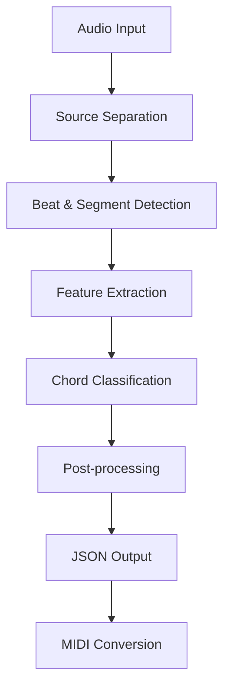
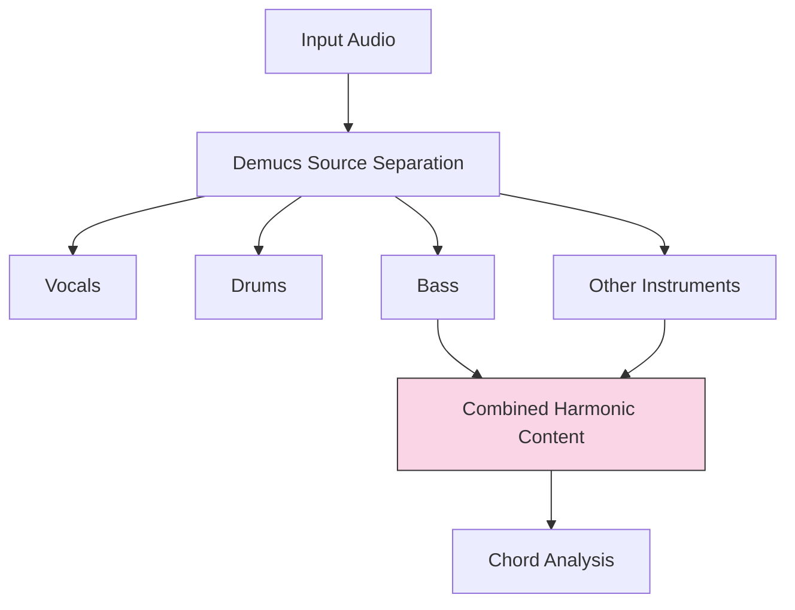
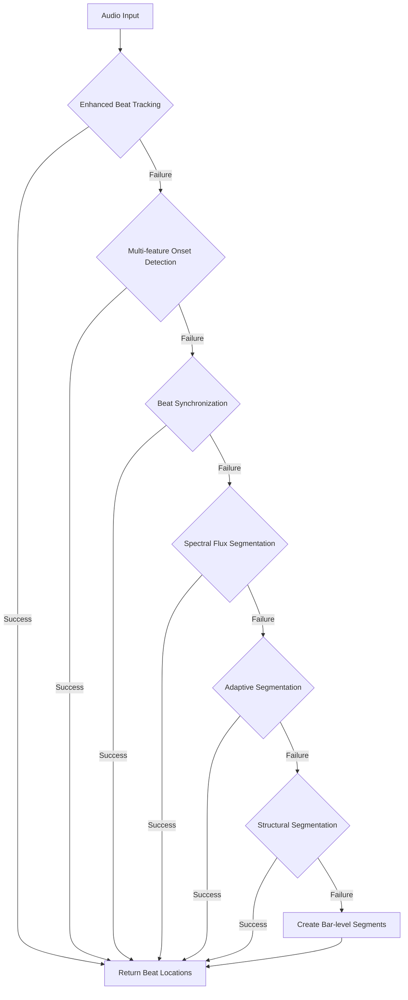
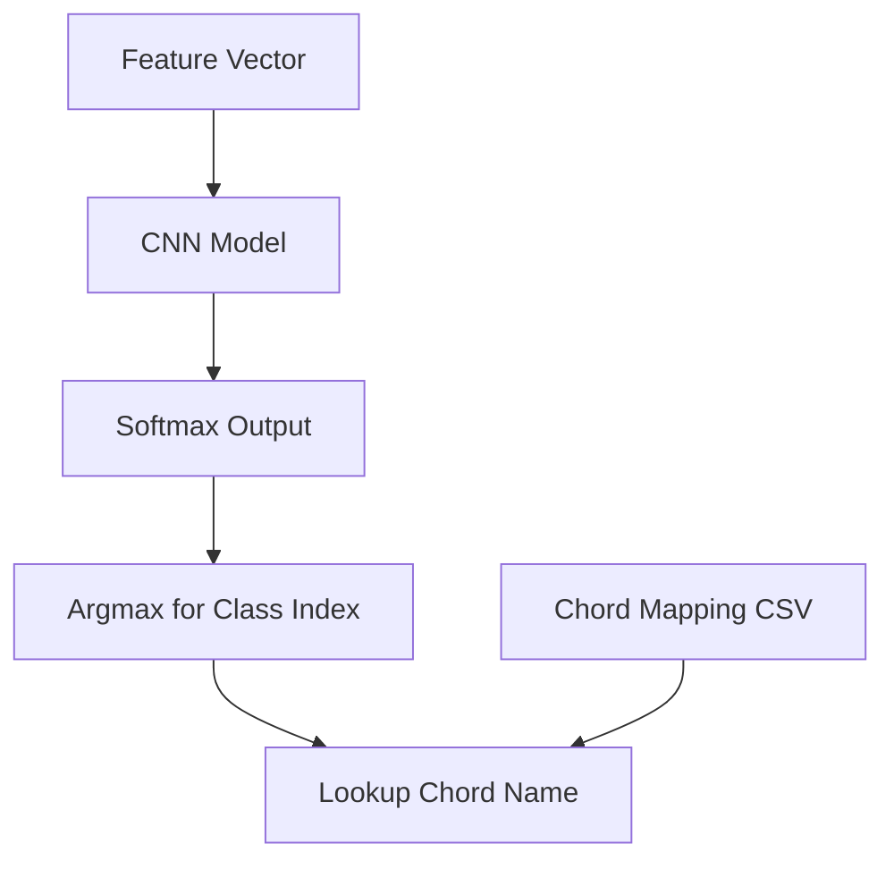
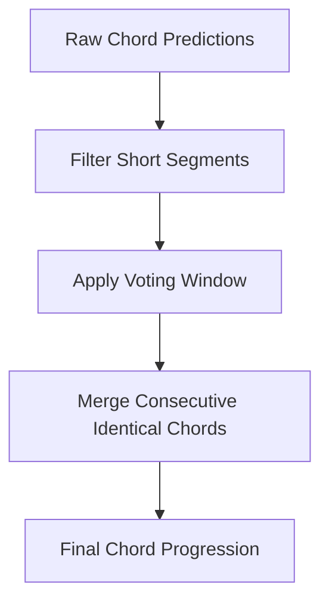

# Inference Pipeline

This document details the inference pipeline that processes audio files and outputs detected chord progressions.

## Overview

The inference pipeline consists of multiple stages that transform raw audio into a structured chord progression:



## 1. Audio Loading

The process begins by loading the audio file:

```python
def process_audio_file(audio_path, model, chord_mapping):
    # Load audio file
    y, sr = librosa.load(audio_path, sr=SAMPLE_RATE)
    
    duration = librosa.get_duration(y=y, sr=sr)
    print(f"Audio duration: {duration:.2f} seconds")
    # ...
```

## 2. Source Separation

If Demucs is available, the system separates the audio into different components:



This improves chord detection by:
- Removing vocals that might conflict with chord tones
- Focusing on harmonic content (instruments + bass)
- Eliminating percussion that adds noise to harmonic analysis

```python
def separate_sources(audio, sr=SAMPLE_RATE):
    if not DEMUCS_AVAILABLE:
        return audio, audio
    
    # Run Demucs to separate sources
    # ...
    
    # Combine bass and other instruments for harmonic content
    combined_harmonic = instruments_only * 0.7 + bass * 0.3
    
    return combined_harmonic, instruments_only
```

## 3. Beat & Segment Detection

The system uses a multi-strategy approach to identify meaningful segments in the audio:



The function tries multiple strategies in sequence until one succeeds:

1. **Enhanced Beat Tracking**: Uses tempo estimation and beat tracking algorithms
2. **Multi-feature Onset Detection**: Combines multiple onset detection functions
3. **Beat Synchronization**: Uses different tightness parameters for beat tracking
4. **Spectral Flux Segmentation**: Finds significant changes in spectral content
5. **Adaptive Segmentation**: Uses dynamic time warping to align a grid to audio features
6. **Structural Segmentation**: Finds structural boundaries in the audio
7. **Bar-level Segmentation**: Creates segments based on estimated tempo

```python
def detect_beats(audio, sr):
    # Pre-process audio to improve beat detection
    audio = librosa.util.normalize(audio)
    audio_filtered = librosa.effects.preemphasis(audio)
    y_harmonic, y_percussive = librosa.effects.hpss(audio_filtered)
    
    # First, get a reliable tempo estimate using multiple methods
    tempo_standard = librosa.beat.tempo(y=y_percussive, sr=sr)[0]
    onset_env = librosa.onset.onset_strength(y=y_percussive, sr=sr)
    tempo_autocorr = librosa.beat.tempo(onset_envelope=onset_env, sr=sr)[0]
    # ...
    
    # Try different strategies in sequence
    # ...
```

## 4. Feature Extraction

Once segments are identified, MFCC features are extracted for each segment:

```mermaid
graph TD
    A[Audio Segment] --> B[Apply Pre-emphasis]
    B --> C[Extract MFCC Features]
    C --> D[Normalize Features]
    D --> E[Shape to Model Input]
    
    subgraph "MFCC Parameters"
        F[40 coefficients]
        G[FFT Window Size: 2048]
        H[Hop Length: 512]
    end
    
    MFCC Parameters --> C
```

The feature extraction ensures compatibility with the trained model:

```python
def extract_features(audio_segment, sr=SAMPLE_RATE, dynamic_duration=None):
    # Use dynamic duration if provided, otherwise fall back to fixed segment
    if dynamic_duration is not None and dynamic_duration > 0:
        expected_length = int(dynamic_duration * sr)
    else:
        expected_length = int(sr * 1.0)  # 1 second default
    
    # Pad or trim the segment if needed
    if len(audio_segment) < expected_length:
        audio_segment = np.pad(audio_segment, (0, expected_length - len(audio_segment)), 'constant')
    elif len(audio_segment) > expected_length:
        audio_segment = audio_segment[:expected_length]
    
    # Apply pre-emphasis to enhance higher frequencies
    audio_segment = librosa.effects.preemphasis(audio_segment)
    
    # Extract MFCCs
    mfccs = librosa.feature.mfcc(
        y=audio_segment, 
        sr=sr, 
        n_mfcc=N_MFCC, 
        n_fft=N_FFT, 
        hop_length=HOP_LENGTH
    )
    
    # Normalize features
    mfccs = (mfccs - np.mean(mfccs)) / (np.std(mfccs) + 1e-10)
    
    # Make sure the shape matches what the model expects
    # ...
```

## 5. Chord Classification

The trained model predicts chord types for each segment:



```python
def classify_chord(model, features, chord_mapping):
    # Make prediction with error handling
    prediction = model.predict(features, verbose=0)
    predicted_class = np.argmax(prediction, axis=1)[0]
    
    # Look up chord name in mapping
    matching_rows = chord_mapping[chord_mapping['index'] == predicted_class]
    if not matching_rows.empty:
        chord = matching_rows['chord'].values[0]
        return chord
    # ...
```

## 6. Post-processing

To improve results, several post-processing steps are applied:



This smoothing process removes unlikely rapid chord changes:

```python
# Post-process: Filter out unlikely rapid chord changes
min_duration_ms = 200
filtered_chords = []

# Apply a simple smoothing filter
if results["chords"]:
    prev_chord = None
    chord_buffer = []
    
    for chord_info in results["chords"]:
        if prev_chord is None:
            # First chord
            prev_chord = chord_info
            chord_buffer.append(chord_info)
        else:
            # Calculate time since previous chord
            time_diff = chord_info["start"] - prev_chord["start"]
            
            if time_diff < min_duration_ms:
                # Too close to previous - add to buffer for voting
                chord_buffer.append(chord_info)
            else:
                # Enough time has passed - select most common chord from buffer
                # ...
```

## 7. Output Generation

The final results are saved as a JSON file with chord names and timestamps:

```json
{
  "bpm": 120.5,
  "chords": [
    {"start": 0, "chord": "C"},
    {"start": 2000, "chord": "G"},
    {"start": 4000, "chord": "Am"},
    {"start": 6000, "chord": "F"}
  ]
}
```

The JSON output can be converted to MIDI using the `midi.py` script.

## Example Usage

To run the inference pipeline:

```bash
# Basic usage
python infer.py song.mp3

# Without source separation
python infer.py song.mp3 --no-demucs

# With custom output path
python infer.py song.mp3 --output=results_song.json
```

## Error Handling

The pipeline includes extensive error handling at each stage, with fallback strategies:

- If Demucs is not available, the original audio is used
- If beat detection fails, alternative segmentation strategies are employed
- If feature extraction encounters errors, default values are used
- If the model fails to predict, a simplified model is created on the fly
- If chord mapping fails, generic chord identifiers are returned

This robust design ensures the pipeline continues even if individual components encounter issues.