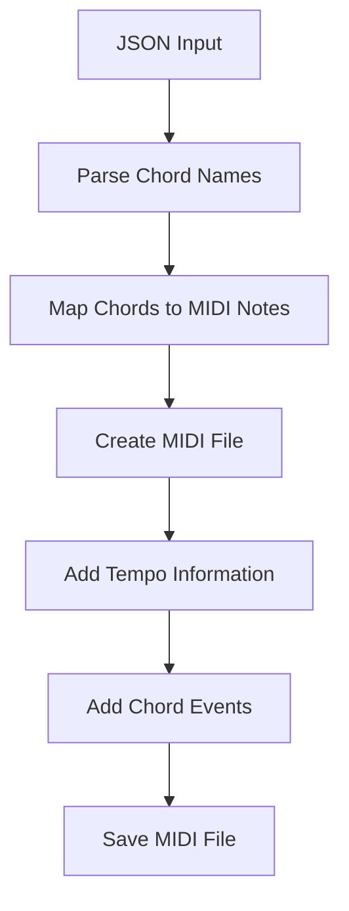
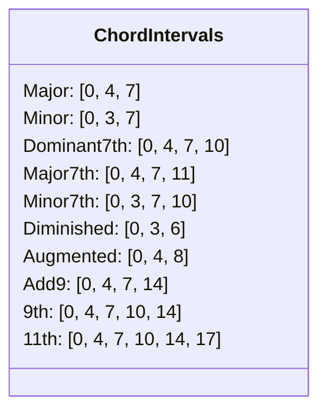
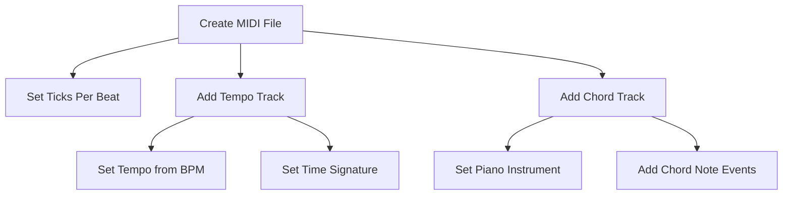
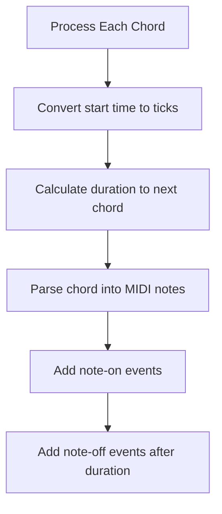

# MIDI Conversion

This document details the process of converting detected chord progressions into MIDI files.

## Overview

The MIDI conversion takes the JSON output from the inference pipeline and transforms it into a playable MIDI file with properly voiced chords:



## Chord Parsing

The first step is to parse the chord names from the JSON file:

```python
def parse_chord(chord_name):
    """
    Parse a chord name and return the MIDI notes for that chord.
    
    Args:
        chord_name: String like "C", "Cm", "G7", etc.
        
    Returns:
        List of MIDI note numbers for that chord
    """
    if chord_name == "N.C." or chord_name == "Unknown" or "Unknown-" in chord_name:
        return []  # No chord
    
    # Extract root and type
    if len(chord_name) > 1 and chord_name[1] in ['#', 'b']:
        root = chord_name[:2]
        chord_type = chord_name[2:]
    else:
        root = chord_name[:1]
        chord_type = chord_name[1:]
    
    # Handle root note
    if root not in ROOT_NOTES:
        print(f"Warning: Unknown root note {root} in chord {chord_name}")
        return []
    
    root_note = ROOT_NOTES[root]
    
    # Handle chord type
    # ...
```

## Chord to MIDI Note Mapping

The system uses detailed mappings for chord types to intervals:



## Root Note Mapping

Root notes are mapped to MIDI note numbers (relative to C=0):

```python
ROOT_NOTES = {
    'C': 0, 'C#': 1, 'Db': 1, 'D': 2, 'D#': 3, 'Eb': 3,
    'E': 4, 'F': 5, 'F#': 6, 'Gb': 6, 'G': 7, 'G#': 8,
    'Ab': 8, 'A': 9, 'A#': 10, 'Bb': 10, 'B': 11
}
```

## MIDI File Creation

The system creates a standard MIDI file with tempo information, a piano track, and chord events:



### Timing Conversion

Timestamps in the JSON file are in milliseconds, but MIDI uses ticks. The conversion function:

```python
def ms_to_ticks(ms, tempo, ticks_per_beat):
    """Convert milliseconds to MIDI ticks."""
    beats_per_ms = tempo / (60 * 1000)
    beats = ms * beats_per_ms
    ticks = beats * ticks_per_beat
    return int(ticks)
```

### Creating the MIDI Structure

```python
def create_midi_file(json_data, output_path):
    mid = MidiFile(ticks_per_beat=TICKS_PER_BEAT)
    
    # Track 0: Tempo and time signature
    track0 = MidiTrack()
    mid.tracks.append(track0)
    
    # Add tempo (convert BPM to microseconds per beat)
    tempo = json_data.get('bpm', 120)
    if tempo <= 0:
        tempo = 120  # Default to 120 BPM if invalid
    
    # Convert BPM to microseconds per beat
    tempo_us = int(60 * 1000 * 1000 / tempo)
    track0.append(MetaMessage('set_tempo', tempo=tempo_us, time=0))
    
    # Add time signature (assume 4/4)
    track0.append(MetaMessage('time_signature', numerator=4, denominator=4, time=0))
    
    # Track 1: Chord progression
    track1 = MidiTrack()
    mid.tracks.append(track1)
    
    # Set the instrument (Piano by default)
    track1.append(Message('program_change', program=DEFAULT_PROGRAM, time=0))
    
    # ...
```

## Adding Chord Events

The system creates MIDI note-on and note-off events for each chord:



```python
# Process each chord
for i, chord_data in enumerate(chords):
    chord_name = chord_data.get('chord', '')
    start_ms = chord_data.get('start', 0)
    
    # Convert start time to ticks
    start_ticks = ms_to_ticks(start_ms, tempo, TICKS_PER_BEAT)
    
    # Calculate delta time from previous events
    delta_ticks = start_ticks - prev_end_ticks
    if delta_ticks < 0:
        delta_ticks = 0
    
    # Parse the chord to get MIDI notes
    midi_notes = parse_chord(chord_name)
    
    # Skip if no valid notes
    if not midi_notes:
        continue
    
    # Calculate end time (when the next chord starts or a reasonable duration)
    if i < len(chords) - 1:
        next_start_ms = chords[i+1].get('start', 0)
        duration_ms = next_start_ms - start_ms
    else:
        # For the last chord, use a reasonable duration (e.g., 2 seconds)
        duration_ms = 2000
    
    # Convert duration to ticks
    duration_ticks = ms_to_ticks(duration_ms, tempo, TICKS_PER_BEAT)
    
    # Add note-on events
    for note in midi_notes:
        track1.append(Message('note_on', note=note, velocity=DEFAULT_VELOCITY, time=delta_ticks))
        delta_ticks = 0  # Only the first note has the delta time
    
    # Add note_off events (after the duration)
    for j, note in enumerate(midi_notes):
        if j == len(midi_notes) - 1:
            # Only the last note_off includes the duration
            track1.append(Message('note_off', note=note, velocity=0, time=duration_ticks))
        else:
            track1.append(Message('note_off', note=note, velocity=0, time=0))
```

## Usage

To convert a JSON file to MIDI:

```bash
python midi.py results.json [output.mid]
```

If no output path is specified, the script will use the same base name as the input file with a .mid extension.

## Sample Output

The resulting MIDI file contains a sequence of block chords that match the chord progression detected in the original audio. This can be:

1. Loaded into a DAW (Digital Audio Workstation)
2. Played back to verify chord detection accuracy
3. Used as a starting point for arrangement and composition
4. Imported into notation software for further editing

## Advanced Features

The MIDI conversion includes several advanced features:

### 1. Alternative Chord Voicings

The system handles various chord types with appropriate voicings:

```python
CHORD_INTERVALS = {
    # Major chords
    '': [0, 4, 7],           # Major (C = C, E, G)
    'maj': [0, 4, 7],        # Major (same as '')
    'M': [0, 4, 7],          # Major (alternate notation)
    
    # Minor chords
    'm': [0, 3, 7],          # Minor (Cm = C, Eb, G)
    'min': [0, 3, 7],        # Minor (alternate notation)
    '-': [0, 3, 7],          # Minor (alternate notation)
    
    # Seventh chords
    '7': [0, 4, 7, 10],      # Dominant 7th (C7 = C, E, G, Bb)
    'maj7': [0, 4, 7, 11],   # Major 7th (Cmaj7 = C, E, G, B)
    'm7': [0, 3, 7, 10],     # Minor 7th (Cm7 = C, Eb, G, Bb)
    
    # Extended chords
    '9': [0, 4, 7, 10, 14],  # Dominant 9th (C9 = C, E, G, Bb, D)
    '11': [0, 4, 7, 10, 14, 17], # 11th chord
    
    # ... more chord types
}
```

### 2. Fallback Handling

For unknown chord types, the system attempts to make intelligent guesses:

```python
# Handle chord type
if chord_type not in CHORD_INTERVALS:
    # Try to handle some common variations and extensions
    if 'add' in chord_type:
        chord_type = 'add9'  # Simplify to add9
    elif 'sus' in chord_type:
        if '4' in chord_type:
            chord_type = 'sus4'
        else:
            chord_type = 'sus2'
    elif '13' in chord_type:
        chord_type = '13'
    # ... more fallbacks
```

### 3. Tempo and Time Signature

The system preserves the tempo detected in the original audio:

```python
# Add tempo (convert BPM to microseconds per beat)
tempo = json_data.get('bpm', 120)
if tempo <= 0:
    tempo = 120  # Default to 120 BPM if invalid

# Convert BPM to microseconds per beat
tempo_us = int(60 * 1000 * 1000 / tempo)
track0.append(MetaMessage('set_tempo', tempo=tempo_us, time=0))
```