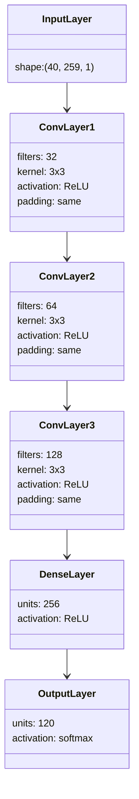
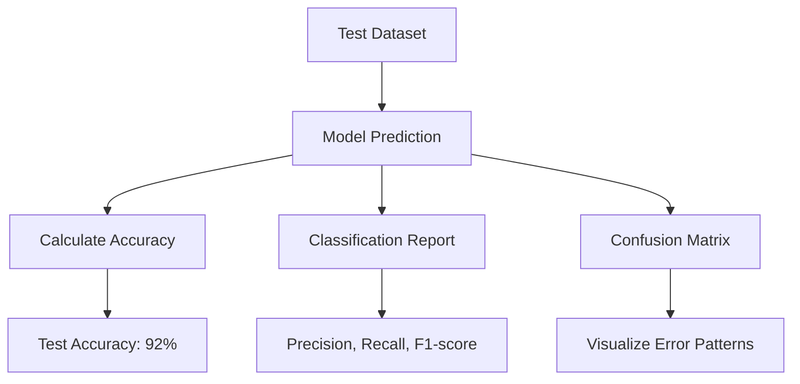

# Model Architecture and Training

This document details the neural network architecture, feature extraction process, and training methodology used in the ChordDetect AI project.

## Feature Extraction

Before training the model, audio features are extracted from each chord sample:

```mermaid
graph TD
    A[Audio Sample] --> B[Load and Preprocess]
    B --> C[Extract MFCC Features]
    C --> D[Normalize Features]
    D --> E[Create Training Data]
    
    subgraph "MFCC Parameters"
        F[40 coefficients]
        G[FFT Window Size: 2048]
        H[Hop Length: 512]
    end
    
    MFCC Parameters --> C
```

### MFCC Features

Mel-frequency cepstral coefficients (MFCCs) are used as the primary features:

- **Number of coefficients**: 40
- **FFT window size**: 2048
- **Hop length**: 512
- **Sample rate**: 44100 Hz
- **Duration**: 3 seconds per sample

MFCCs capture the spectral shape of the audio in a way that aligns with human perception, making them ideal for chord recognition.

### Data Preparation

```python
def extract_features(file_path, segment_duration=3.0):
    # Load audio file (use just the first segment_duration seconds)
    y, sr = librosa.load(file_path, sr=SAMPLE_RATE, duration=segment_duration)
    
    # Pad if audio is shorter than segment_duration
    if len(y) < max_duration:
        y = np.pad(y, (0, max_duration - len(y)), 'constant')
    
    # Extract MFCCs
    mfccs = librosa.feature.mfcc(y=y, sr=sr, n_mfcc=N_MFCC, n_fft=N_FFT, hop_length=HOP_LENGTH)
    
    # Normalize MFCCs
    mfccs = (mfccs - np.mean(mfccs)) / np.std(mfccs)
    
    return mfccs
```

## Neural Network Architecture

The model is a convolutional neural network (CNN) designed to identify patterns in the frequency domain:



### Model Implementation

```python
def build_model(input_shape, num_classes):
    model = models.Sequential([
        # Input layer
        layers.Input(shape=input_shape),
        
        # Convolutional layers
        layers.Reshape((*input_shape, 1)),  # Add channel dimension
        layers.Conv2D(32, (3, 3), activation='relu', padding='same'),
        layers.MaxPooling2D((2, 2)),
        layers.Dropout(0.25),
        
        layers.Conv2D(64, (3, 3), activation='relu', padding='same'),
        layers.MaxPooling2D((2, 2)),
        layers.Dropout(0.25),
        
        layers.Conv2D(128, (3, 3), activation='relu', padding='same'),
        layers.MaxPooling2D((2, 2)),
        layers.Dropout(0.25),
        
        # Flatten and dense layers
        layers.Flatten(),
        layers.Dense(256, activation='relu'),
        layers.Dropout(0.5),
        layers.Dense(num_classes, activation='softmax')
    ])
    
    # Compile the model
    model.compile(
        optimizer='adam',
        loss='sparse_categorical_crossentropy',
        metrics=['accuracy']
    )
    
    return model
```

### Architecture Details

1. **Input Layer**: Takes MFCC features with shape (40, 259)
2. **Reshape Layer**: Adds a channel dimension for 2D convolution
3. **Convolutional Layers**:
   - Three blocks of Conv2D → MaxPooling → Dropout
   - Increasing filter counts (32 → 64 → 128)
4. **Dense Layers**:
   - Flatten layer to convert 2D data to 1D
   - 256-unit dense layer with ReLU activation
   - Dropout for regularization
5. **Output Layer**:
   - 120 units (one for each chord class)
   - Softmax activation for probability distribution

## Training Process

The model training incorporates several best practices:

```mermaid
graph TD
    A[Prepare Dataset] --> B[Split Data]
    B --> C[Train Model]
    C --> D[Evaluate Performance]
    
    subgraph "Data Split"
        E[Training Set: 60%]
        F[Validation Set: 20%]
        G[Test Set: 20%]
    end
    
    subgraph "Training Configuration"
        H[Optimizer: Adam]
        I[Loss: Sparse Categorical CrossEntropy]
        J[Batch Size: 32]
        K[Epochs: Up to 30]
    end
    
    subgraph "Callbacks"
        L[Early Stopping: patience=5]
        M[ReduceLROnPlateau: factor=0.5, patience=2]
    end
    
    Data Split --> C
    Training Configuration --> C
    Callbacks --> C
```

### Training Strategy

```python
def train_model(model, X_train, y_train, X_val, y_val, epochs=30, batch_size=32):
    # Define callbacks
    callbacks = [
        tf.keras.callbacks.EarlyStopping(
            monitor='val_loss',
            patience=5,
            restore_best_weights=True
        ),
        tf.keras.callbacks.ReduceLROnPlateau(
            monitor='val_loss',
            factor=0.5,
            patience=2,
            min_lr=1e-6
        )
    ]
    
    # Train the model
    history = model.fit(
        X_train, y_train,
        validation_data=(X_val, y_val),
        epochs=epochs,
        batch_size=batch_size,
        callbacks=callbacks
    )
    
    return history
```

### Key Training Features

1. **Data Splitting**:
   - 60% training, 20% validation, 20% testing
   - Stratified split to maintain class distribution

2. **Regularization**:
   - Dropout layers (0.25 after conv layers, 0.5 after dense layer)
   - Early stopping to prevent overfitting

3. **Learning Rate Schedule**:
   - Reduce learning rate when validation loss plateaus
   - Factor: 0.5, patience: 2 epochs

4. **Early Stopping**:
   - Monitor validation loss
   - Patience: 5 epochs
   - Restore best weights

## Model Evaluation

The model's performance is evaluated using several metrics:



### Evaluation Metrics

- **Test Accuracy**: Overall percentage of correctly classified chords
- **Confusion Matrix**: Visualization of prediction patterns and errors
- **Per-class Metrics**:
  - Precision: Ratio of true positives to all predicted positives
  - Recall: Ratio of true positives to all actual positives
  - F1-score: Harmonic mean of precision and recall

### Visual Analysis

The training history and confusion matrix are plotted to help analyze model performance:

```python
def plot_history(history):
    plt.figure(figsize=(12, 5))
    
    # Plot accuracy
    plt.subplot(1, 2, 1)
    plt.plot(history.history['accuracy'], label='Train')
    plt.plot(history.history['val_accuracy'], label='Validation')
    plt.title('Model Accuracy')
    plt.xlabel('Epoch')
    plt.ylabel('Accuracy')
    plt.legend()
    
    # Plot loss
    plt.subplot(1, 2, 2)
    plt.plot(history.history['loss'], label='Train')
    plt.plot(history.history['val_loss'], label='Validation')
    plt.title('Model Loss')
    plt.xlabel('Epoch')
    plt.ylabel('Loss')
    plt.legend()
    
    plt.tight_layout()
    plt.savefig('training_history.png')
```

## Model Deployment

After training, the model and chord mapping are saved for use in the inference pipeline:

```python
# Save model
model.save(MODEL_SAVE_PATH)

# Save class mapping
class_mapping = pd.DataFrame({
    'index': range(len(label_encoder.classes_)),
    'chord': label_encoder.classes_
})
class_mapping.to_csv('chord_mapping.csv', index=False)
```

The saved model (`chord_classifier_model.h5`) and chord mapping (`chord_mapping.csv`) are used by the inference module to classify chords in new audio files.